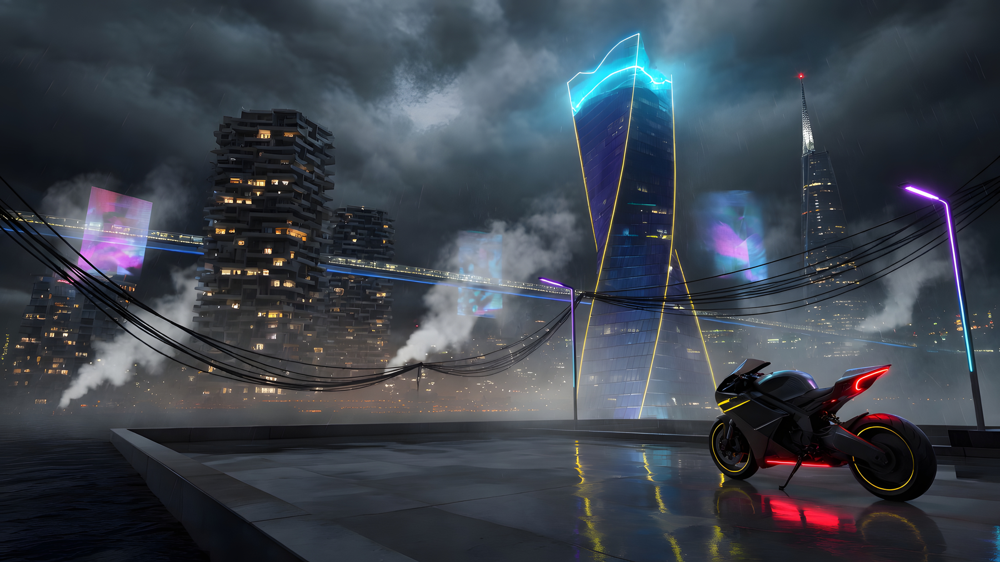

# Cyberpunk 2077

Night City Omarchy theme: CDPR yellow (`#fcee0a`) on purple-black, HUD cyan, and trauma-team red. Four **3840×2160** wallpapers — rain, fog, megabuildings, holograms, cables, and wet plazas. No character art.

Fan work inspired by *Cyberpunk 2077*. Not affiliated with CD PROJEKT RED.



## Install

```bash
omarchy theme install https://github.com/YOUR_GITHUB_USER/omarchy-cyberpunk-2077-theme.git
```

Then:

```bash
omarchy theme set "Cyberpunk 2077"
```

Or Walker: `Super+Alt+Space` → Install → Theme → paste the repo URL.

Cycle wallpapers with `omarchy theme bg next`. The default is `1-night-city-plaza.jpg`.

## Wallpapers

| File | Shot |
|---|---|
| `backgrounds/1-night-city-plaza.jpg` | Wet plaza, twisted tower, stacked megabuildings, bike |
| `backgrounds/2-skybridge-walkway.jpg` | Rain-soaked walkway over a neon street |
| `backgrounds/3-stacked-megabuilding.jpg` | Stacked slab housing, skybridge, yellow-cyan bike |
| `backgrounds/4-harbor-dock.jpg` | Dock, hologram kiosks, motorcycle, harbor skyline |

All four are 3840×2160.

## Palette

| Role | Hex |
|---|---|
| Accent / yellow | `#fcee0a` |
| Background | `#0d0a12` |
| Foreground | `#ece6ef` |
| Cyan | `#00f0ff` |
| Magenta | `#ff2a6d` |
| Red | `#ff003c` |
| Green | `#00ff9f` |

Icons: Yaru Yellow. Window borders: yellow → cyan gradient.

## License

MIT. *Cyberpunk 2077* and Night City are trademarks of CD PROJEKT S.A.
